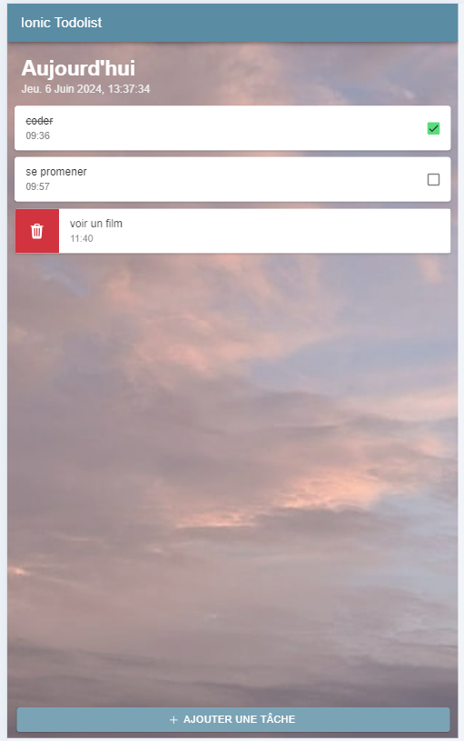

# ToDoList App

This ToDoList application allows users to add, view, complete and delete tasks. The data is stored in a Firebase Realtime Database, enabling users to receive immediate updates on tasks.

## Screenshot

## Features

- Add new tasks
- View tasks with their creation time
- Mark tasks as completed
- Delete tasks
- Data persistence in Firebase Realtime Database

## Technologies Used

- Ionic Framework: For building the mobile user interface
- Angular: Javascript framework for building dynamic web applications
- Firebase: Google's development platform for build web and mobile applications

## Project structure

- home.page.html: Contains the layout of the main page
- home.page.ts: Contains the application logic for managing tasks
- app.module.ts: Configures Ionic, Angular and Firebase modules
